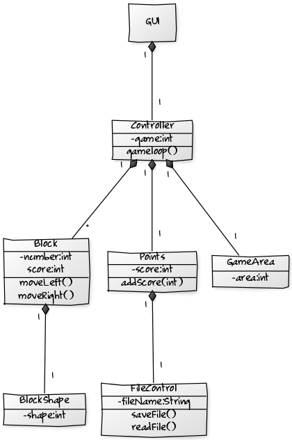

#Aihe 

Tetris-peli, jossa pinotaan satunnaisen muotoisia palikoita päällekkäin. 
Pisteitä saa kun onnistuu sovittamaan palikoista yhtenäisen kerroksen.

## Käyttäjän toiminnot

 - pelin käynnistys
 - pisteiden tarkistus
 - pelikontrollit pelin kuluessa
 - nimen syöttö pistetaulukkoon

## Pelikontrollit

 - palikoita liikutellaan nuolinäppäimillä vasemmalta oikealle
 - palikoita voidaan kääntää välilyöntinäppäimellä
 
## Pelialue ja pelin kulku

 - suorakaiteen muotoinen alue ohjelmaikkunassa
 - pelipalikat ilmestyvät pelialueen yläreunaan
 - josta ne tippuvat vakionopeudella alaspäin
 - palikat pysähtyvät pelialueen pohjalle
 - kun palikoista onnistuu sovittamaan yhtenäisen kerroksen, se häviää
 - peli päättyy kun pelaaja ei onnistu sovittamaan palikkaa ja seuraava 
 palikka leikkaa pelialueella jo olevia palikoita

## Pistenäyttö

 - pelialueen ulkopuolella on pistenäyttö
 - pisteet tallennetaan tulostiedostoon

## Luokkakaavio

